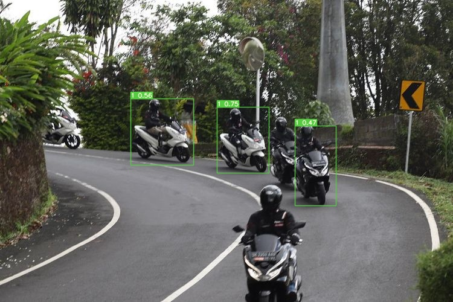

# YOLOv7 Custom Object Detection for Commonly Type of Vehicles in Indonesia

Custom object detection using YOLOv7-tiny for detecting and classifying type of vehicles that are commonly found in Indonesia.

## Custom Dataset

The object to be detected as a vehicle is the type of vehicles that matches the specification from [Surat Edaran Direktur Jenderal Bina Marga Nomor 22/SE/Db/2021 tentang Manual Aplikasi Sistem Program Pemeliharaan Jalan Provinsi/Kabupaten atau Provincial/Kabupaten Road](https://binamarga.pu.go.id/index.php/nspk/detail/surat-edaran-direktur-jenderal-bina-marga-nomor-22sedb2021-tentang-manual-aplikasi-sistem-program-pemeliharaan-jalan-provinsikabupaten-atau-provincialkabupaten-road-management-system-pkrms-manual-nomor-04mbm2021).

From that document, there are 12 types of vehicles. 
These vehicles are often on the road.

We collected vehicle images from the internet, such as Google and Kaggle datasets. 
But those images is not enough, we collected more images from road traffic video that we personally recorded to use as a dataset. <br>
The label or class distribution of each type of vehicles in the dataset is shown in the table below.

| Label | Type of vehicle | Total | Percentage |
| :-: | :-: | :-: | :-: |
| 1 | Motorcycle, bajaj | 10612 | 25.90% |
| 2 | Sedan, jeep, family car, station wagon | 13479 | 25.90% |
| 3 | Mini-bus, commuter car | 1686 | 4.11% |
| 4 | Pick-up | 3350 | 8.18% |
| 5a | Small bus | 1053 | 2.57% |
| 5b | Big bus | 2198 | 5.37% |
| 6a | 4-wheeled truck | 2143 | 5.22% |
| 6b | 6-wheeled truck | 2354 | 5.75% |
| 7a | 3-axle truck | 1143 | 2.79% |
| 7b | Double load truck | 100 | 0.24% |
| 7c | Truck trailer | 746 | 1.82% |
| 8 | Non-motorized vehicle | 2104 | 5.14% |
|| **Total number of labels** | **40968** | **100%** |

The dataset is publicly available on <a href="https://www.kaggle.com/datasets/mochimamrifai/lhr-yolov7"></a>

## Installation

This section is the installation process from YOLOv7 official repository.

Docker environment (recommended)
<details><summary> <b>Expand</b> </summary>

``` shell
# create the docker container, you can change the share memory size if you have more.
nvidia-docker run --name yolov7 -it -v your_coco_path/:/coco/ -v your_code_path/:/yolov7 --shm-size=64g nvcr.io/nvidia/pytorch:21.08-py3

# apt install required packages
apt update
apt install -y zip htop screen libgl1-mesa-glx

# pip install required packages
pip install seaborn thop

# go to code folder
cd /yolov7
```

</details>


## Training and Testing

**Complete process of training and testing is available on my Kaggle's notebook** <a href="https://www.kaggle.com/code/mochimamrifai/yolov7customobjectdetection"></a>

Before starting the training process, the first step is to clone the repository from the official YOLOv7 <a href="https://github.com/WongKinYiu/yolov7"> </a>

```shell
git clone https://github.com/WongKinYiu/yolov7.git
```

Install the required modules for YOLOv7

```shell
cd yolov7
pip install -r requirements.txt
```

### Transfer Learning

Transfer learning is a method to train a pre-trained model using custom dataset.

```shell
python train.py --device 0 --batch-size 8 --epochs 100 \
 --img 640 640 --data './data/custom_coco.yaml' \
 --hyp './data/hyp.scratch.custom.yaml' \
 --cfg './cfg/training/yolov7-tiny-custom.yaml' \
 --weights './weights/yolov7-tiny.pt' \
 --name yolov7-tiny-custom
```

The above command will run the training process using single GPU. The batch size used during training is 8 and epochs are 100.

### Resume Training

If the training process is interrupted or forced to pause while not reaching the last epoch, we can resume the training process.

```shell
python train.py --device 0 --batch-size 8 --epochs 100 \
 --img 640 640 --data './data/custom_coco.yaml' \
 --hyp './data/hyp.scratch.custom.yaml' \
 --cfg './cfg/training/yolov7-tiny-custom.yaml' \
 --weights './runs/train/yolov7-tiny-custom/weights/last.pt' \
 --name yolov7-tiny-custom \
 --resume
```

### Testing

```shell
python test.py --data './data/custom_coco.yaml' \
 --img 640 --batch 32 --conf-thres 0.001 \
 --iou-thres 0.65 --device 0 \
 --weights './runs/train/yolov7-tiny-custom/weights/best.pt' \
 --exist-ok --name yolov7-tiny-custom_val
```

## Performance

The performance of the YOLOv7-tiny custom object detection model was tested on an NVIDIA Jetson Nano device using [video](./src/videos/sample_2.mp4).

<table>
    <thead>
        <tr>
            <th>Type of Vehicle</th>
            <th>True Positive</th>
            <th>False Positive</th>
            <th>False Negative</th>
            <th>Actual Vehicle Count</th>
            <th>Average FPS</th>
        </tr>
    </thead>
    <tbody align="center">
        <tr>
            <td>1</td>
            <td>132</td>
            <td>0</td>
            <td>5</td>
            <td>137</td>
            <td rowspan=14>6 FPS</td>
        </tr>
        <tr>
            <td>2</td>
            <td>59</td>
            <td>1</td>
            <td>0</td>
            <td>60</td>
        </tr>
        <tr>
            <td>3</td>
            <td>0</td>
            <td>0</td>
            <td>0</td>
            <td>0</td>
        </tr> 
        <tr>
            <td>4</td>
            <td>5</td>
            <td>0</td>
            <td>0</td>
            <td>5</td>
        </tr>
        <tr>
            <td>5a</td>
            <td>0</td>
            <td>0</td>
            <td>0</td>
            <td>0</td>
        </tr>
        <tr>
            <td>5b</td>
            <td>1</td>
            <td>0</td>
            <td>0</td>
            <td>1</td>
        </tr>
        <tr>
            <td>6a</td>
            <td>0</td>
            <td>0</td>
            <td>0</td>
            <td>0</td>
        </tr>
        <tr>
            <td>6b</td>
            <td>1</td>
            <td>1</td>
            <td>0</td>
            <td>2</td>
        </tr>
        <tr>
            <td>7a</td>
            <td>0</td>
            <td>0</td>
            <td>0</td>
            <td>0</td>
        </tr>
        <tr>
            <td>7b</td>
            <td>0</td>
            <td>0</td>
            <td>0</td>
            <td>0</td>
        </tr>
        <tr>
            <td>7c</td>
            <td>0</td>
            <td>0</td>
            <td>0</td>
            <td>0</td>
        </tr>
        <tr>
            <td>8</td>
            <td>0</td>
            <td>0</td>
            <td>0</td>
            <td>0</td>
        </tr>
        <tr>
            <td><strong>Total</strong></td>
            <td>198</td>
            <td>2</td>
            <td>5</td>
            <td>205</td>
        </tr>
        <tr>
            <td><strong>Percentage</strong></td>
            <td>96.58%</td>
            <td>0.98%</td>
            <td>2.44%</td>
            <td>100%</td>
        </tr>
    </tbody>
</table>

## Inference

On video:
``` shell
python detect.py --device 0 --weights './runs/train/yolov7-tiny-custom/weights/best.pt' \
 --conf 0.4 --img-size 640 --no-trace \
 --source 'src/videos/sample_2.mp4'
```

[](https://youtu.be/Tjeui6epCZM)

On image:
``` shell
python detect.py --device 0 --weights './runs/train/yolov7-tiny-custom/weights/best.pt' \
 --conf 0.4 --img-size 640 --no-trace \
 --source 'src/images/image.jpg'
```

<div align="center">
    
</div>

## Export

**Pytorch to CoreML (and inference on MacOS/iOS)** <a href="https://colab.research.google.com/github/WongKinYiu/yolov7/blob/main/tools/YOLOv7CoreML.ipynb"></a>

**Pytorch to ONNX with NMS (and inference)** <a href="https://colab.research.google.com/github/WongKinYiu/yolov7/blob/main/tools/YOLOv7onnx.ipynb"></a>
```shell
python export.py --weights yolov7-tiny.pt --grid --end2end --simplify \
        --topk-all 100 --iou-thres 0.65 --conf-thres 0.35 --img-size 640 640 --max-wh 640
```

**Pytorch to TensorRT with NMS (and inference)** <a href="https://colab.research.google.com/github/WongKinYiu/yolov7/blob/main/tools/YOLOv7trt.ipynb"></a>

```shell
wget https://github.com/WongKinYiu/yolov7/releases/download/v0.1/yolov7-tiny.pt
python export.py --weights ./yolov7-tiny.pt --grid --end2end --simplify --topk-all 100 --iou-thres 0.65 --conf-thres 0.35 --img-size 640 640
git clone https://github.com/Linaom1214/tensorrt-python.git
python ./tensorrt-python/export.py -o yolov7-tiny.onnx -e yolov7-tiny-nms.trt -p fp16
```

**Pytorch to TensorRT another way** <a href="https://colab.research.google.com/gist/AlexeyAB/fcb47ae544cf284eb24d8ad8e880d45c/yolov7trtlinaom.ipynb"></a> <details><summary> <b>Expand</b> </summary>


```shell
wget https://github.com/WongKinYiu/yolov7/releases/download/v0.1/yolov7-tiny.pt
python export.py --weights yolov7-tiny.pt --grid --include-nms
git clone https://github.com/Linaom1214/tensorrt-python.git
python ./tensorrt-python/export.py -o yolov7-tiny.onnx -e yolov7-tiny-nms.trt -p fp16

# Or use trtexec to convert ONNX to TensorRT engine
/usr/src/tensorrt/bin/trtexec --onnx=yolov7-tiny.onnx --saveEngine=yolov7-tiny-nms.trt --fp16
```

</details>

Tested with: Python 3.7.13, Pytorch 1.12.0+cu113

## Acknowledgements

<details><summary> <b>Expand</b> </summary>

* [https://github.com/WongKinYiu/yolov7](https://github.com/WongKinYiu/yolov7)
* [https://github.com/AlexeyAB/darknet](https://github.com/AlexeyAB/darknet)
* [https://github.com/WongKinYiu/yolor](https://github.com/WongKinYiu/yolor)
* [https://github.com/WongKinYiu/PyTorch_YOLOv4](https://github.com/WongKinYiu/PyTorch_YOLOv4)
* [https://github.com/WongKinYiu/ScaledYOLOv4](https://github.com/WongKinYiu/ScaledYOLOv4)
* [https://github.com/Megvii-BaseDetection/YOLOX](https://github.com/Megvii-BaseDetection/YOLOX)
* [https://github.com/ultralytics/yolov3](https://github.com/ultralytics/yolov3)
* [https://github.com/ultralytics/yolov5](https://github.com/ultralytics/yolov5)
* [https://github.com/DingXiaoH/RepVGG](https://github.com/DingXiaoH/RepVGG)
* [https://github.com/JUGGHM/OREPA_CVPR2022](https://github.com/JUGGHM/OREPA_CVPR2022)
* [https://github.com/TexasInstruments/edgeai-yolov5/tree/yolo-pose](https://github.com/TexasInstruments/edgeai-yolov5/tree/yolo-pose)

</details>
